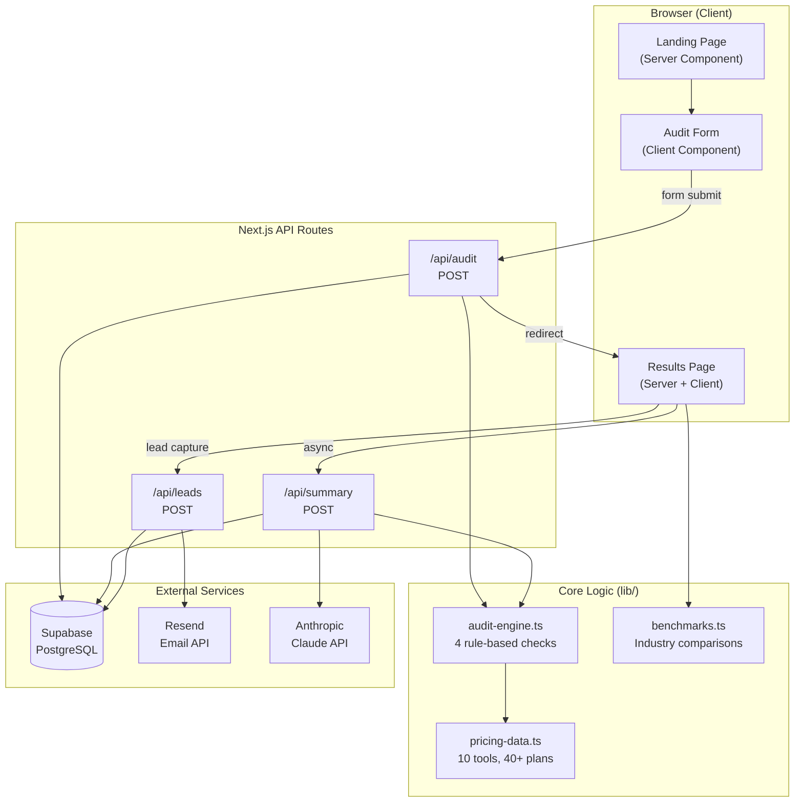
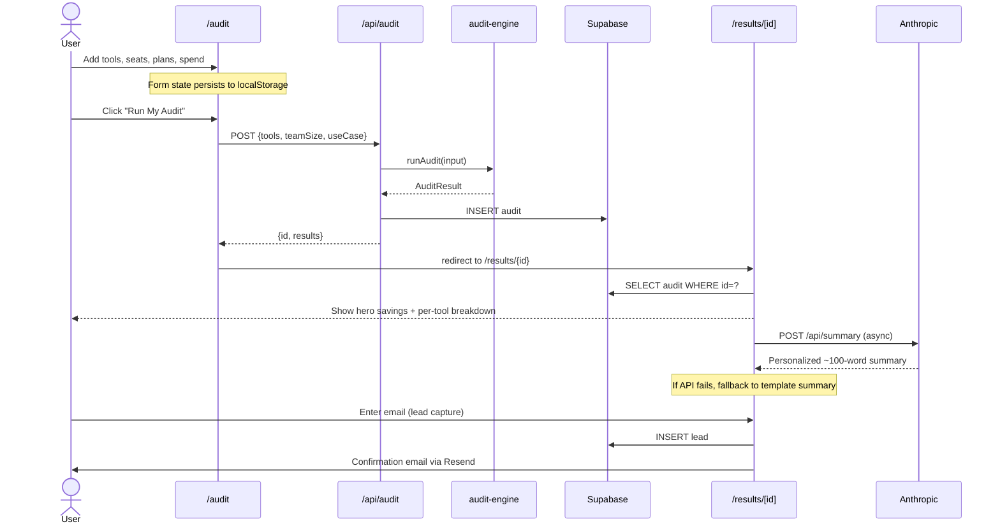

# ARCHITECTURE — PromptBudget

## System Architecture



## Data Flow



## Stack Rationale

| Choice | Why |
|--------|-----|
| **Next.js 16** | App Router gives us server components for SEO, API routes for backend, and React 19 for client interactivity. One framework, no separate backend. |
| **Supabase** | PostgreSQL with instant REST API. Row Level Security for public audit access. Free tier is generous enough for an MVP. |
| **Resend** | Modern email API with great DX. React email support. Free tier for transactional emails. |
| **Anthropic Claude** | Best-in-class for summarization. Sonnet 4.6 balances quality and cost. Fallback template ensures 100% availability. |
| **Tailwind v4** | Utility-first CSS with design tokens. v4's CSS-first config works well with Next.js 16. |
| **shadcn/ui** | Copy-paste component library. No dependency bloat. Full customization. |
| **Vitest** | Fast test runner with native TypeScript support. ESM-first. Compatible with the project's module system. |

## Key Design Decisions

### 1. Client-Side vs. Server-Side Audit Execution
The audit engine runs **server-side** via the API route. This ensures:
- Pricing data can't be reverse-engineered from the client bundle
- Results are saved atomically (audit + save in one request)
- The engine logic is testable in isolation

### 2. Hardcoded vs. AI-Generated Recommendations
All audit logic is **hardcoded** (rule-based). This is intentional:
- A financial advisor should be able to verify every recommendation
- AI-generated advice would be non-deterministic and harder to trust
- The only AI usage is the summary paragraph (clearly labeled)

### 3. Email After Value (Never Before)
Lead capture happens **after** the full results are displayed. This:
- Builds trust by providing value first
- Increases conversion by letting users see the quality
- Avoids the "gated content" anti-pattern that drives bounce

### 4. Graceful Degradation
Every external dependency has a fallback:
- Anthropic API → template summary
- Supabase insert → still return results
- Email send → don't fail the request
- localStorage → form still works without persistence

## Folder Structure

```
promptbudget/
├── app/
│   ├── page.tsx              # Landing page (Server Component)
│   ├── layout.tsx            # Root layout with SEO metadata
│   ├── globals.css           # Design system
│   ├── audit/
│   │   └── page.tsx          # Audit input form (Client Component)
│   ├── results/
│   │   └── [id]/
│   │       ├── page.tsx      # Results (Server: data + metadata)
│   │       └── results-client.tsx  # Results (Client: interactivity)
│   └── api/
│       ├── audit/route.ts    # Run audit + save
│       ├── leads/route.ts    # Capture lead + email
│       └── summary/route.ts  # AI summary generation
├── components/
│   ├── ui/                   # shadcn/ui primitives
│   ├── navbar.tsx            # Shared navigation
│   ├── theme-toggle.tsx      # Dark/light mode
│   ├── lead-form.tsx         # Lead capture form
│   ├── result-card.tsx       # Per-tool result card
│   ├── tool-card.tsx         # Landing page feature card
│   ├── benchmark-section.tsx # Industry benchmark comparison
│   └── spend-charts.tsx      # Spend visualization charts
├── lib/
│   ├── types.ts              # All TypeScript types
│   ├── pricing-data.ts       # 10 tools, 40+ plans
│   ├── audit-engine.ts       # Core audit logic (4 rules)
│   ├── benchmarks.ts         # Industry comparison data
│   ├── supabase.ts           # Supabase client
│   └── email.ts              # Resend client
├── __tests__/
│   └── audit-engine.test.ts  # 30 tests across 8 groups
└── .github/workflows/
    └── ci.yml                # Lint + test + build
```

## Security Considerations

- **No PII on public URLs**: Results pages show tools and savings but never email, company name, or personal data
- **Honeypot anti-spam**: Hidden form field catches bots without impacting UX
- **Rate limiting**: 5 requests per 15 minutes per IP on lead capture
- **Row Level Security**: Supabase RLS restricts read access to public audits only
- **Environment variables**: All secrets stored in `.env.local`, never committed
